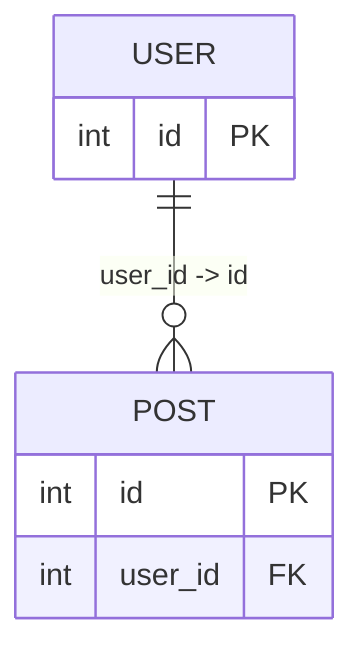

# SQL schema import and export

## Import

- **Workspace:** choose **Import SQL** in the navigation sidebar to create a new saved diagram.
- **Live Editor:** choose **Import SQL** in the header (under **More editor actions** on mobile) to replace the current diagram.
- **Existing editable diagram:** open **Ctrl/Cmd + K → Import SQL schema** to replace its content. The replacement participates in canvas Undo/Redo.

Select **PostgreSQL** or **MySQL / MariaDB**, paste DDL or upload a `.sql` file, then choose **Preview schema**. Review the table/column/FK counts and conversion notes before applying.

Parsing runs in the browser. The importer does not connect to a database or execute SQL. Use schema-only DDL; row data, functions, triggers, grants and session settings are not diagram content. Input is limited to 2 MB and generated workspace documents to 1 MB.

Supported structures include:

- Qualified and quoted table/column names.
- Column types, nullability, defaults and comments.
- Primary keys, unique constraints and foreign keys, including composite keys and FK actions.
- Inline constraints and common `ALTER TABLE ... ADD CONSTRAINT` forms.
- Ordinary indexes, PostgreSQL partial indexes and `INCLUDE` columns.
- PostgreSQL enum definitions, serial/identity columns, sequences and sequence ownership.
- MySQL/MariaDB `AUTO_INCREMENT`, enum types, generated columns, table comments, engine, character set and collation.

Unsupported statements/options are reported in conversion notes. This is a table-schema importer, not a complete migration interpreter: destructive migrations, views, inheritance/partition semantics, expression indexes, triggers and stored procedures are not reconstructed. MySQL version-conditional DDL comments are not imported. Use plain `CREATE TABLE` DDL for those objects.

## Export

Open **Export → SQL**, select the target database and review **SQL preview** and conversion notes. Choose **Copy SQL** or **Download SQL**. In the Live Editor, **Ctrl/Cmd + K → Export diagram** opens this dialog too.

The output is a **schema creation snapshot**, not a diff/migration against an existing database. Tables and indexes are created before FK constraints, allowing cyclic table dependencies. PostgreSQL namespaces become schemas; MySQL namespaces become databases.

### Round-trip metadata

Imported diagrams end with a `%% sql-schema-v1:` Mermaid comment. It contains base64-encoded, normalized supported DDL and the source dialect—not the original SQL dump or row data. It travels with the diagram through workspace persistence, sharing, history and MMD export.

Keep this comment to preserve information Mermaid cannot express, including defaults, nullable flags, composite unique grouping, indexes and FK column mappings. Base64 is an encoding, not encryption.

Export reads the **current visible entities/fields**, not just the imported snapshot:

- Added/removed fields and edited PK/UK/FK tags change the generated SQL.
- Changing a field's type drops its imported default/generated expression and produces a note.
- Removing an imported relationship removes its physical FK.
- CHECK expressions are omitted with a note if the original fields changed.
- A renamed table/field that no longer matches import metadata is treated as new; review its types, defaults and constraints in the preview.
- Changing a descriptive Mermaid field comment does not change SQL nullability/defaults.
- Graph layout and manually routed relationships do not affect the SQL.

### Hand-authored ER diagrams

Without import metadata, export can create columns and PK/UK constraints. Non-PK fields are nullable. A Mermaid relationship such as `USER ||--o{ POST : owns` does not identify the physical FK columns; the exporter reports this rather than guessing.

For a relation from a parent table to a child table, use an explicit label:

Composite mapping example: `"tenant_id, user_id -> tenant_id, id"`. The left list belongs to the child (right-hand entity); the right list belongs to the parent (left-hand entity).

### Cross-database conversion

Common type/auto-generation conversions are supported, with explicit notes for changes such as PostgreSQL UUID → MySQL CHAR(36), JSONB/arrays → JSON, timezone semantics, unsigned integers, or MySQL enum/set → PostgreSQL TEXT. Database-specific default expressions, CHECK clauses and indexes may be omitted with a note. Unknown cross-database types fall back to TEXT and are identified in the preview.

Generated SQL should be reviewed against the target database version, especially for MySQL/MariaDB generated columns, JSON/default expressions and CHECK enforcement.
